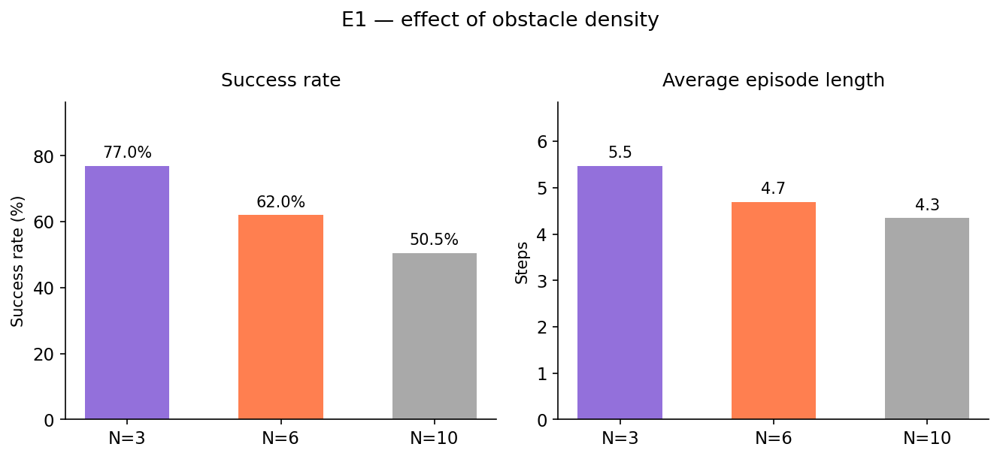
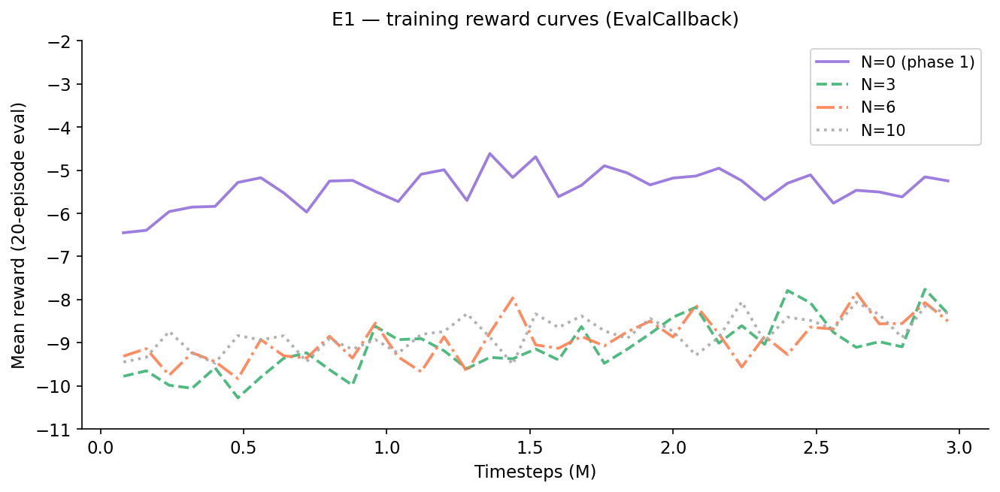
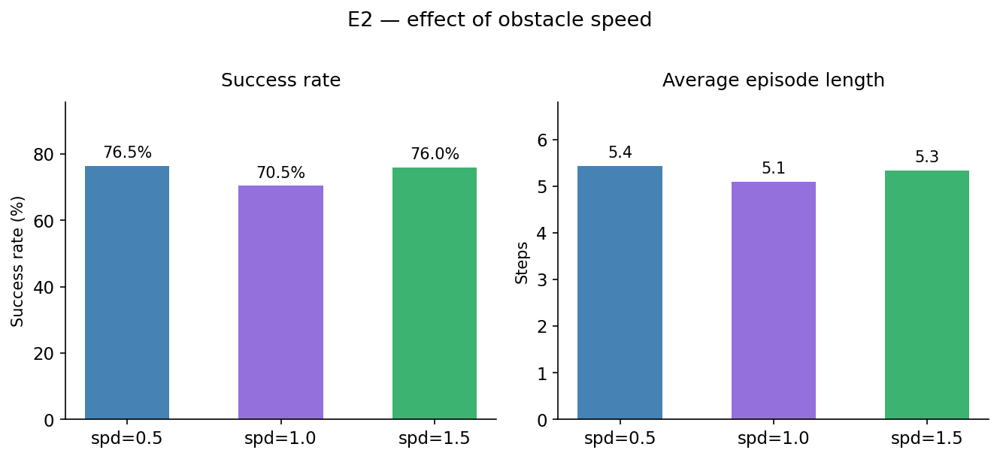
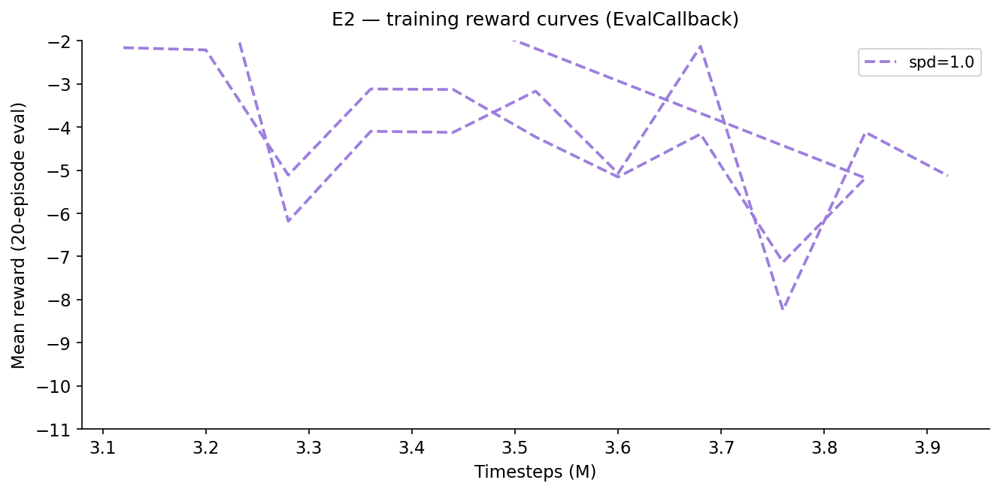
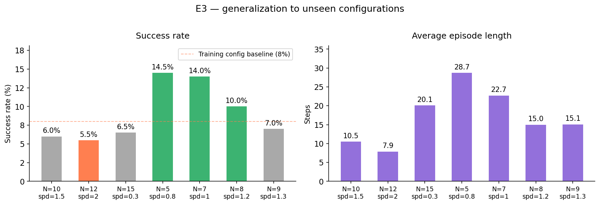
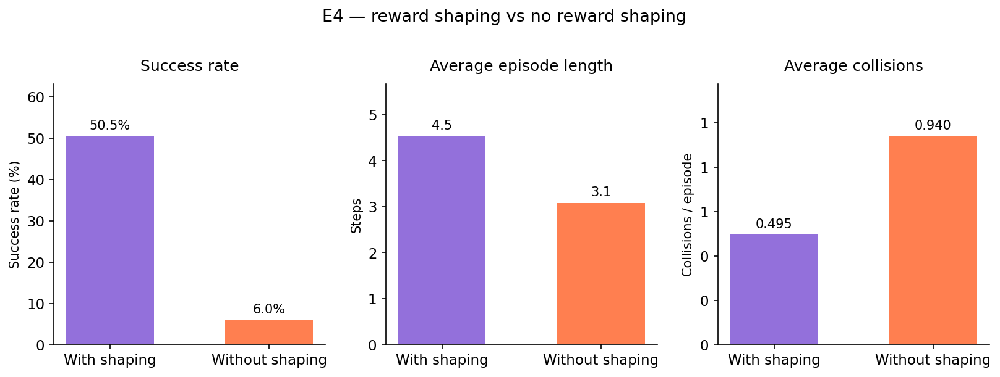
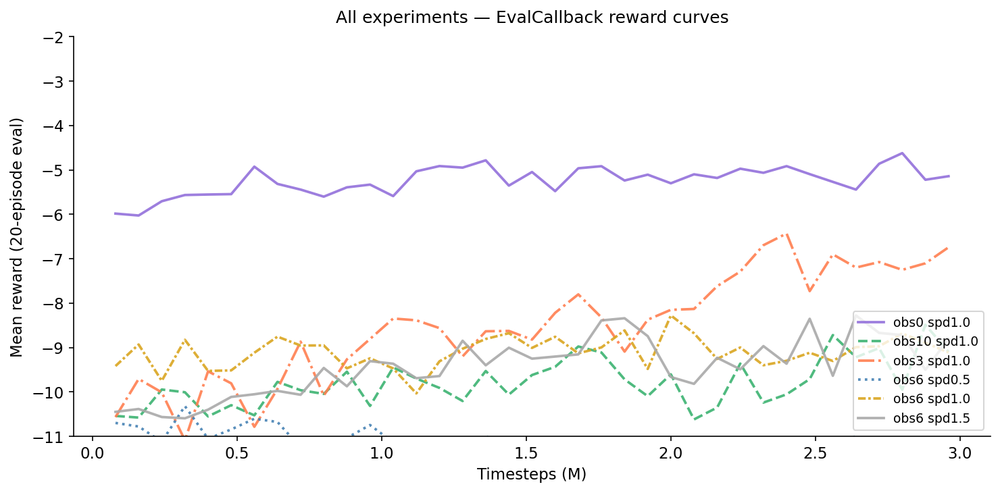

# Evaluation Results — v2.0 (Observation + Reward Updates)

This document summarizes the results of four experiments run to evaluate a PPO-based robot navigation agent trained with the v2.0-obs-reward changes. All experiments use 200 evaluation episodes with a deterministic policy.

Compared to v1.0-baseline, this version introduces three changes: LIDAR resolution increased from 8 to 24 rays, observation space extended with velocities of the three nearest dynamic obstacles and a proximity penalty added to the reward function.

---

## Training configuration

| Parameter | Value |
|---|---|
| Algorithm | PPO |
| Network | MLP `[256, 256]` |
| Observation space | 24 lidar rays, agent velocity, target direction, 3 nearest obstacle velocities |
| Action space | Continuous velocity control |
| Base training config | N=6 obstacles, speed=1.0 |
| Total timesteps | 3,000,000 |

---

## E1 — Effect of obstacle density

The model trained on N=6, speed=1.0 was evaluated across three obstacle counts at fixed speed=1.0.

| Obstacles | Success | Collisions | Truncated | Avg steps | Avg col/ep | vs v1 |
|---|---|---|---|---|---|---|
| N=3 | 21.0% (42/200) | 78.5% | 0.5% | 41.6 | 0.785 | +8.0pp |
| N=6 (training) | 14.5% (29/200) | 85.5% | 0.0% | 20.2 | 0.855 | +6.5pp |
| N=10 | 8.5% (17/200) | 91.5% | 0.0% | 10.4 | 0.915 | +2.5pp |

All three configurations improved compared to v1. The biggest gain is at N=3 (+8.0pp) and at the training configuration N=6 (+6.5pp), which suggests the richer observation space is helping the agent navigate more effectively when obstacle density is moderate. At N=10 the gain is smaller — with a lot of fast-moving obstacles the proximity penalty and velocity signals seem to help less.

Average episode length drops from 41.6 at N=3 to 10.4 at N=10, the same pattern as in v1, but the higher success rates suggest the agent is now reaching the goal more often rather than just colliding a bit later.

---

## E2 — Effect of obstacle speed

Model trained on N=6, speed=1.0. Evaluated on different speeds at fixed N=6.

| Speed | Success | Collisions | Truncated | Avg steps | Avg col/ep | vs v1 |
|---|---|---|---|---|---|---|
| 0.5 (slower) | 1.0% (2/200) | 96.5% | 2.5% | 79.5 | 0.965 | -7.0pp |
| 1.0 (training) | 10.0% (20/200) | 90.0% | 0.0% | 24.6 | 0.900 | +0.5pp |
| 1.5 (faster) | 15.0% (30/200) | 85.0% | 0.0% | 12.3 | 0.850 | -2.5pp |

The most interesting result here is the big drop at speed=0.5 — from 8.0% in v1 down to just 1.0%. A likely explanation is that the proximity penalty is causing this: slow obstacles stay in the agent's path longer, so the agent gets sustained penalties for being near them but hasn't learned how to go around them — it ends up hesitating and either colliding or running out of steps (2.5% truncated, compared to 0% in v1).

At speed=1.5 the result is slightly lower than v1 (15.0% vs 17.5%), though the gap is small. At the training speed of 1.0 the results are almost identical (+0.5pp).

---

## E3 — Generalization to unseen configurations

Evaluated on seven configurations not seen during training.

| Obstacles | Speed | Success | Collisions | Truncated | Avg steps | Avg col/ep | vs v1 |
|---|---|---|---|---|---|---|---|
| 5 | 0.8 | 14.5% (29/200) | 85.5% | 0.0% | 28.7 | 0.855 | +0.5pp |
| 7 | 1.0 | 14.0% (28/200) | 86.0% | 0.0% | 22.7 | 0.860 | +4.0pp |
| 8 | 1.2 | 10.0% (20/200) | 90.0% | 0.0% | 15.0 | 0.900 | +2.0pp |
| 9 | 1.3 | 7.0% (14/200) | 93.0% | 0.0% | 15.1 | 0.930 | -2.0pp |
| 10 | 1.5 | 6.0% (12/200) | 94.0% | 0.0% | 10.5 | 0.940 | +2.0pp |
| 12 | 2.0 | 5.5% (11/200) | 94.5% | 0.0% | 7.9 | 0.945 | +0.0pp |
| 15 | 0.3 | 6.5% (13/200) | 93.5% | 0.0% | 20.1 | 0.935 | +0.0pp |

Generalization results are mostly the same as v1 or a bit better. The biggest improvement is at N=7/speed=1.0 (+4.0pp). The only notable regression is N=9/speed=1.3 (-2.0pp), though the difference is small enough that it could just be noise. Configurations with very slow obstacles (speed=0.3) or very high density (N=12, N=15) are still hard for the agent, for the same reasons as in E2 — the proximity penalty seems to hurt more than it helps in those cases.

---

## E4 — Effect of reward shaping

Both models trained on N=6, speed=1.0 for 3,000,000 timesteps.

| Variant | Success | Collisions | Truncated | Avg steps | Avg col/ep | vs v1 |
|---|---|---|---|---|---|---|
| With shaping | 7.5% (15/200) | 92.5% | 0.0% | 30.0 | 0.925 | -2.0pp |
| Without shaping | 7.5% (15/200) | 92.5% | 0.0% | 28.8 | 0.925 | +0.0pp |

Both variants end up at exactly 7.5%, which is different from v1 where the shaping variant was slightly better (9.5% vs 7.5%). One possible explanation is that the proximity penalty is creating a conflict with the progress reward — the agent is being pushed toward the goal but also penalized for being close to obstacles that might be in the way. Without shaping, neither signal is present and the agent ends up with the same result anyway. Either way, reward shaping doesn't seem to be making a consistent difference with the current setup.

---

## Overview — all training curves

---

## Overall summary

| Experiment | Best result | Configuration | vs v1 |
|---|---|---|---|
| E1 | 21.0% | N=3, speed=1.0 | +8.0pp |
| E2 | 15.0% | N=6, speed=1.5 | -2.5pp |
| E3 | 14.5% | N=5, speed=0.8 | +0.5pp |
| E4 | 7.5% | N=6, speed=1.0 | -2.0pp |

The v2 changes have a clear positive effect in E1 — the agent handles different obstacle densities noticeably better than in v1. E3 generalization is mostly stable or slightly improved. The regressions in E2 (slow obstacles) and E4 (shaping) both point to the proximity penalty needing better tuning: with slow or dense obstacles the agent gets penalized a lot without having learned how to avoid them, which ends up hurting performance.

The 24-ray LIDAR and obstacle velocity observations do seem to be helping — the additional LIDAR rays and obstacle velocity observations may allow the agent to react earlier to moving obstacles, which explains the E1 gains. For a next version, curriculum learning (starting from N=0 and gradually increasing difficulty) could help the agent first learn basic navigation before dealing with the full penalty signal, which might fix the slow-obstacle regression seen in E2.

Results should be interpreted with the understanding that each configuration was evaluated over 200 episodes, so small differences may reflect evaluation variance.

---